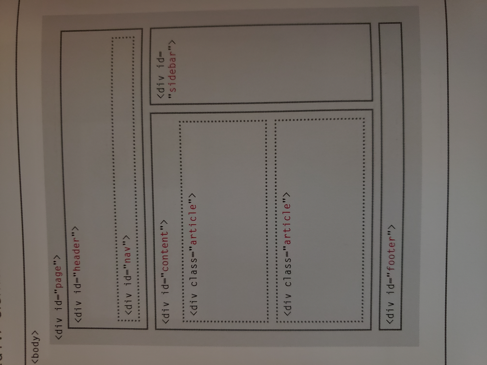
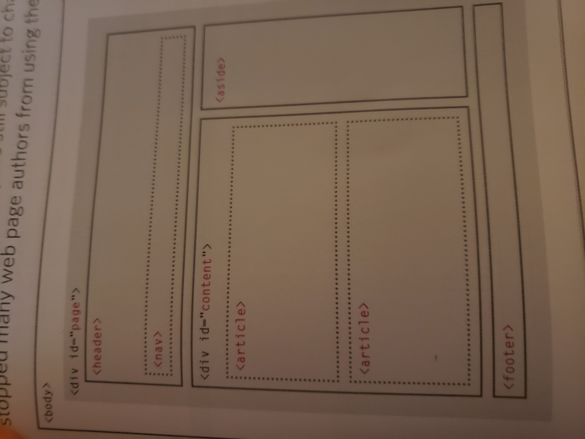

HTML / Markup
Semantics
Wireframe
Personas
Meta
Content
Element
Tag
Attribute
Structure vs Presentation

# Reading Notes

- the new HTML5 elements indicate the purpose of different parts of a web page and help to sdescribe its structure.

- the new elements provide clearer code (compared with using multiple < div > elements.)

- older browsers that do not understand HTML5 elements need to be told which elements are block-level elements.

- to make HTML5 elements work in Internet Explorer 8 (and older versions of IE), extra JavaScript is needed, 
which is available free from Goodle.

## Traditional HTML layouts

**For a long time,** web page authors used < div > elements to group together related elements 
on the page (such as the elements that form a header, an ariticle, fotter or sidebar). Authors 
used class or id attributes to indicate the role of the < div > element in the structure of the page.

*Common layout*

- At the top of the page is the header, containing a logo and the primary navigation

- under this are one or more articles or posts. Sometimes these are summaries that link to individual posts.

- there is a side bar on the right hand side (perhaps featuring a search option, links to other recent articles, 
other sections of the site, or even ads).

- when coding a site like this, developers would usually put these main sections of the page inside < div > 
elements and use the class or id attributesto indicate the purpose of that part of the page.

## New HTML5 layout elements

**HTML5** introduces a new set of elements that allow you to divide up the parts of a page. The names of 
these elements indicate the kind of content you will find in them. They are still subject to change, but 
that has not stopped many web page authors from using them already.

*New HTML5 Layout*

- This example has exactly the same structure as seen on the previous page. However, many of the < div > elements 
have been replaced by new HTML5 layout elements

- the header sits inside a new < header > element, the nav in a < nav > element, and the articles are in individual
< article > elements.

- the point of creating these new elements is so that web page authors can use them to help descrive the structure 
of the page. For example, screen reader software might allow users to ignore headers and footers and get straight 
to the content. Similarly, search engines might place more weight on the content in an < article > element than 
that in the < header > or < footer > elements. I think you will agree that it also makes the code easier to follow.
